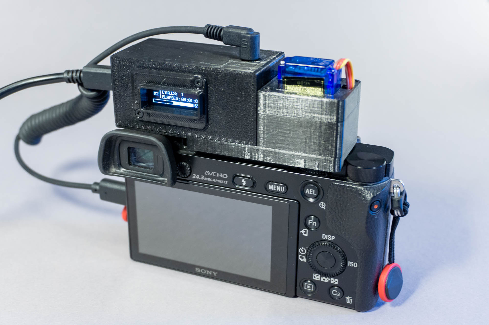

This is the code and CAD files for the MindControlHat, a small 3d-printed gadget for Sony a6000 cameras to switch modes (P, A, S, M, ...) and trigger the shutter in intervals. This allows to capture image sequences for ultra-long exposure photography and [digital solargraphies](https://volzo.de/posts/solargraphy2/).

Fusion360/Step CAD files can be found in /CAD

EasyEDA files (including BOM) for the PCB can be found at the EasyEDA [project page](https://oshwlab.com/volzo/mindcontrolhat_copy_copy).